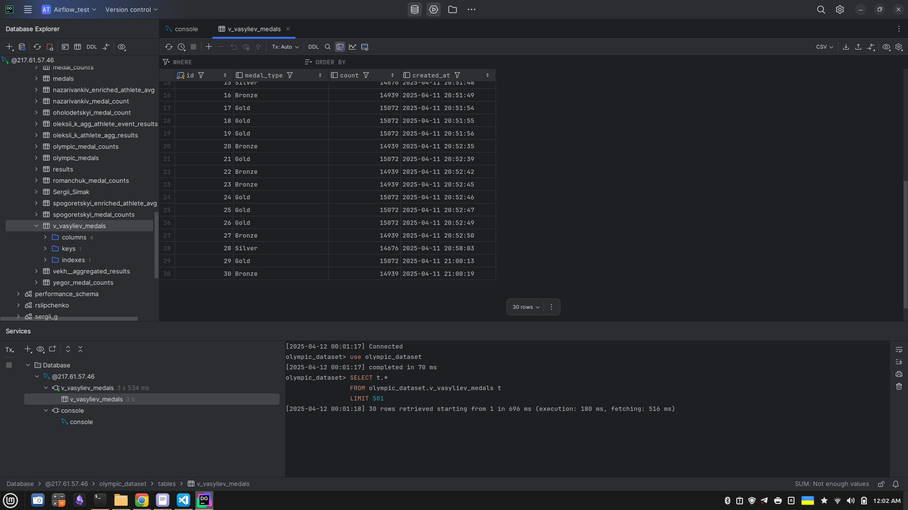
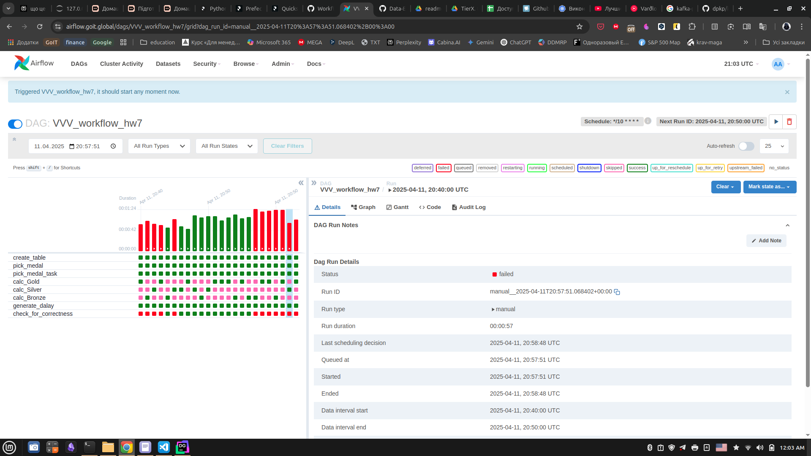

# 1. Скріншот результату запису в SQL-таблицю:

# 2. Скріншот результатів виконання DAG

В коді python-файлу, який описує DAG, час затримки визначається псевдо-випадковим чином в діапазоні 25-35 сек.
Відповідно, на скріншоті видно різні випадки, де останній тригер спрацьовував (в середині послідовності виконання DAG'ів), а де - ні (на початку та в кінці послідовності).
